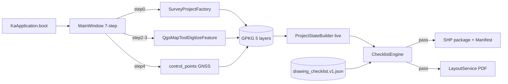

# ka-hgis data-flow graph (production sprint)

## Critical path (P0)

## Nodes
| Node | Role |
| --- | --- |
| KaApplication | QgsApplication init, prefix/PATH |
| MainWindow steps 0-6 | Beginner IA |
| SurveyProjectFactory | Create domain GPKG |
| survey_area, feature_poly, feature_line, section_line, control_points | Domain layers |
| ProjectStateBuilder | Live QJsonObject for checklist |
| ChecklistEngine | Rule eval |
| LayoutService | QgsPrintLayout + QgsLayoutExporter |
| ExportService / ShpPackage | SHP + README + MANIFEST.sha256 |

## Gaps closed by this sprint
| GAP | Node fix |
| --- | --- |
| Stub counters | ProjectStateBuilder |
| Digitize shallow | Digitize + attr gate |
| Fake PDF | LayoutService |
| Partial SHP | writeAsVectorFormatV3 package |
| Hardcode D:/qgis | rulesPath portable |

## Parallel P1
GNSS quality fields, topology/extent, hash manifest, e2e deepen
