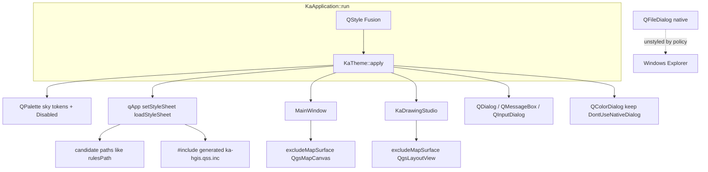
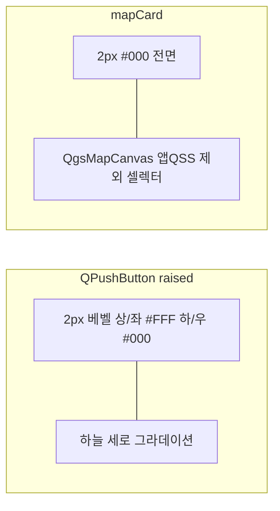
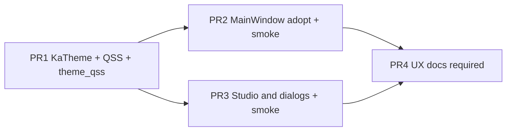

# ka-hgis 하늘색 3D 크롬 · 검정 테두리 · 현장 중심 IA

| 항목 | 값 |
| --- | --- |
| Document | Sky-blue 3D application chrome / black region borders / user-centered IA |
| Product | ka-hgis (고고학 전용 HGIS) 0.3.0 |
| Author | Grok Build (architect) |
| Date | 2026-08-15 |
| Status | Draft (rev 4 — user: native QFileDialog; PR1 authorized) |
| Scope | Application chrome, theme, IA grouping — **not** map rendering, **not** 도면 시트 장식, **not** export CRS |
| Audience | 구현 담당 (C++20 / Qt6 / OSGeo4W qgis-dev) |

---

## Overview

현장 사용자가 요청한 것은 GIS 엔진 교체가 아니라 **모든 창·버튼·팝업을 하늘색 3D(입체)로 통일**하고, **검정 테두리로 구역을 분리**하며, **아이콘 툴바 IA를 유지한 채 배치를 현장 중심으로** 다듬는 것이다.

현재 바이너리는 테마가 **세 갈래로 싸운다**.

1. `KaApplication::run` — Fusion + 하늘색 `QPalette` (`#E8F1FB`)
2. `MainWindow::applyPhase1Theme` — 양피지/베이지 + 틸/앰버 QSS + **검정 툴바 `#111827`** 로 팔레트를 **덮어씀** (`qApp->setStyleSheet` + 창 시트, `MainWindow.cpp` L502–632)
3. `KaDrawingStudio::buildUi` — 창 시트와 **위젯 로컬 시트**가 겹치는 셀렉터만 흰/회색으로 덮음 (앱 시트 전체를 지우지는 않음; §1 고통 지점)

제안: **단일 `KaTheme` 서비스**가 부팅 시 Fusion 팔레트 + 하늘색 3D QSS + 검정 구역 테두리를 `qApp`에 한 번 적용한다. QSS는 **닫힌 셀렉터 목록**(§7)이다. `QgsMapCanvas` / `QgsLayoutView` 는 **앱 QSS 제외 셀렉터 + `excludeMapSurface` 보조**로만 보호한다. 아이콘 툴바(새조사/열기/저장/위성/지적/그리기/선택/속성/도면/검수/보내기/찾기)와 숨긴 텍스트 메뉴는 유지한다. **기각된 7단계 레일은 복원하지 않는다.** 도면 창의 **샘플 스트립**(북화살/축척/범례 타일)은 레일이 아니며 유지한다.

---

## Background & Motivation

### 왜 필요한가

- 사용자는 창·버튼·팝업이 **한눈에 같은 제품**이길 원한다. 지금 메인 창은 다크 크롬+양피지, 조판 창은 흰 플랫 + 다크 조정바, 앱 부팅 팔레트는 하늘색이라 “프로그램이 세 개처럼” 보인다.
- 현장(노트북, 실외 글레어)에서는 연한 크림 1px 테두리보다 **검정 구역선**이 지도/크롬/다이얼로그를 구분하기 쉽다.
- `docs/ux/ia-beginner.md` / `docs/ux/mainwindow-wireframe.md` / `docs/architecture/data-flow.md` 는 여전히 7단계 레일을 SSOT처럼 적고 있으나, 제품 SSOT(`HANDOFF.md` §1 Product 항목 7)와 코드는 이미 **아이콘 툴바 + 숨긴 메뉴**다. 테마 작업이 낡은 IA를 되살리면 회귀다.

### 현재 상태 (코드 기준)

| 위치 | 하는 일 | 문제 |
| --- | --- | --- |
| `src/app/KaApplication.cpp` L438–454 | `app.setStyle("Fusion")` + 하늘색 팔레트 | 의도된 방향에 가깝지만 QSS/3D/검정 테두리 없음. `PlaceholderText`/Disabled 그룹 없음 |
| `src/app/MainWindow.cpp` `applyPhase1Theme()` L502–632 | `qApp->setPalette` + ~110줄 인라인 QSS + `qApp->setStyleSheet` + `setStyleSheet` | 양피지·틸·다크 툴바로 **하늘색을 즉시 무효화**. 스핀/콤보 서브컨트롤은 여기만 있음 |
| `MainWindow::buildUi` L667–673 | 캔버스 **로컬** 시트 비우기 + `WA_StyledBackground=false` | 앱 QSS는 그대로 적용됨. 실제 제외는 Phase-1의 `QgsMapCanvas { background:none }` |
| `MainWindow::buildMenus` L274–398 | 아이콘 툴바 IA (제품 SSOT) | 유지. 다크 툴바 QSS만 교체. `QToolBar#mainToolbar` 만 스타일하면 카드 안 `QToolButton` 누락 |
| `src/app/KaDrawingStudio.cpp` L236–251, L330–333, L694–700, L752, L771, L840, L892, L909–920 | 창 시트 + 다수 위젯 시트 | 겹치는 셀렉터만 덮음. `#topRail` / `makeRailTile` 은 **용지 샘플 크롬**이지 7단계 레일이 아님 |
| `newSurvey` / `addUserLayer` CRS 토글 L1153–1159, L2286–2292 | 인라인 파란 필 버튼 QSS | 전역 3D 규칙과 충돌 |
| `kaPaintColorButton` L2036–2047 | 면색 미리보기. `DontUseNativeDialog` 이미 설정 (L2054–2056) | 예외로 유지. 외곽을 `#0369a1`/radius 10 → `#000`/4px 로 맞춤 |
| `kaMakeArrowSpin` L2097–2109 | 커스텀 ▲▼ + 시안 3D | Phase-1 스핀 화살표와 별개. 로컬 예외로 유지 |
| `KaLayoutWindow::buildUi` | 조판 구형 창, 스타일 없음 | 제품 경로가 아님(`KaDrawingStudio`가 도면). 앱 시트만 상속. `#layoutView` 제외 계약은 동일 |

`filesCard` / `workDock` / `checkDock` / `menuBar` 는 이미 기본 숨김. `더보기`로만 연다. 이 IA는 유지한다. `MainWindow.cpp` 는 3464줄.

### 고통 지점

- 테마 문자열이 `MainWindow.cpp`에 박혀 있어 조판·팝업·`QColorDialog`까지 한곳에서 고칠 수 없다.
- Qt는 `qApp` 시트와 위젯 시트를 **합친다**. 위젯 `setStyleSheet` 는 그 **서브트리에서 겹치는 셀렉터만** 이긴다. 앱 시트를 지우지 않는다. 조판이 하늘색이 아닌 이유는 (1) Phase-1이 `qApp`를 양피지로 덮고 (2) 스튜디오가 `QMainWindow`/`QToolBar`/`QStatusBar`/`#topRail`/`#itemInspector`/`#scaleChip`/`#mapAdjustBar`/`makeRailTile`/`drawerCardQss` 를 흰·회색·다크로 다시 덮기 때문이다. 창 단위 `setStyleSheet` 한 줄만 지워서는 부족하다 (§8 표).
- `docs/architecture/data-flow.md` 가 아직 `MainWindow 7-step` 을 그린다. `docs/user/gui-scenario-checklist.md` 시나리오 A 는 “단계3…단계7” 이다. 구현자가 문서를 따르면 기각된 레일을 다시 만들 위험이 있다. **문서 수정은 선택 작업이 아니다** (PR4).

### 병렬 작업과의 경계 (혼동 금지)

`KaDrawingStudio::applyStandardChromePositions()` + `LayoutService::standardSheetChrome` 은 **용지 위** 축척막대/CRS/방위를 지도 **아래**에 놓는 시트 크롬이다. **이 문서의 대상이 아니다.** PR3(조판 테마)은 이 두 함수를 **호출·수정하지 않는다.** 업로드 CRS **EPSG:5179** 도 변경하지 않는다.

조판 **책상색**(용지 밖)은 이미 `setBackgroundBrush(QColor(229,231,235))` (`#E5E7EB`, `KaDrawingStudio.cpp` L676–678, L931). **그대로 둔다.** QSS로 `#layoutView` 를 칠하지 않는다.

---

## Goals & Non-Goals

### Goals

1. 모든 **앱이 소유한** 창·툴바·버튼(툴바 **밖** `QToolButton` 포함)·메뉴·도크·모달(`QDialog` / `QMessageBox` / `QInputDialog` / `QColorDialog`)에 **하늘색 3D(raised/inset)** 를 적용한다. `#mainToolbar` 전용 규칙만으로는 Goal 1을 충족하지 못한다.
2. 창 / 도크 / 카드 / 툴바 / 팝업 / **지도 vs 크롬** 경계를 **검정 테두리**로 분리한다. OS 네이티브 타이틀바 바깥 링은 요구하지 않는다 (§3, Visual QA).
3. 현장 고고학자 기준 IA: 주 행동이 아이콘+한글 라벨로 항상 보이고, 밀도는 지금 툴바 그룹을 따른다.
4. 테마는 **한 서비스** (`KaTheme`) — 위젯별 일회성 QSS를 §8 예외·변환 표 밖으로 줄인다.
5. GIS 수명주기 불변: 캔버스 렌더, OTF, `setLayers`, 도메인 레이어 추가 경로, 편집 버퍼를 건드리지 않는다.

### Non-Goals

- QGIS 포크, `qgis_gui` 위젯 재구현, 프레이임리스 커스텀 타이틀바
- 7단계 레일 / 왼쪽 워크플로 독 복원
- 도면 **샘플 스트립** 삭제 (북화살/축척/범례 타일 — 레일이 아님)
- `LayoutService` 시트 장식(축척·방위·CRS 위치) 변경, `applyStandardChromePositions` 수정
- 조판 책상색 `#E5E7EB` 변경
- 업로드/내보내기 CRS를 5179 이외로 변경
- DXF 제출 경로, VWorld 키 하드코딩
- 새 조사 시 빈 도메인 레이어 범례 자동 추가
- `loadSurveyLayers` 에서 `removeAllMapLayers`
- 다크 모드, 테마 전환 토글 (이번 범위 없음)
- Windows 네이티브 제목 표시줄 / 네이티브 `QFileDialog` 스킨 (OS가 그림)
- 지도 타일·심볼·인쇄 용지 배경을 하늘색으로 칠하기
- `QWidget` / `QGraphicsView` / ID 없는 `QFrame` 일괄 규칙

---

## Proposed Design

### 1. 아키텍처

테마는 **앱 크롬**이므로 `src/core` 가 아니라 `src/app` 에 둔다. GIS 서비스(`LayerOps`, `ExportService`, …)는 색을 모른다. `excludeMapSurface` 는 `QWidget*` 만 받고 **`qgs*.h` 를 include 하지 않는다** (`ka_theme_tests` 가 QGIS DLL을 끌지 않게).



부팅 순서 (`src/app/KaApplication.cpp`):

1. `QgsApplication` / `QApplication` 생성 (기존)
2. `app.setStyle("Fusion")` (유지)
3. **`KaTheme::apply(&app)`** — 팔레트 + `loadStyleSheet()` (`qApp->setStyleSheet`). 이후 **어떤 창도 `qApp->setStyleSheet` 를 다시 호출하지 않는다.**
4. `MainWindow` 생성. `applyPhase1Theme()` 는 **PR2에서 삭제.** `buildUi` 는 레이아웃 + `excludeMapSurface(m_canvas)` + `setCanvasColor`.
5. `KaDrawingStudio` 는 앱 시트를 상속. 창 시트와 §8 표의 로컬 시트를 삭제·변환. `excludeMapSurface(m_view)`. 책상색은 기존 `setBackgroundBrush(#E5E7EB)`.

### 2. 토큰 (SSOT)

이름은 코드 상수. QSS에는 hex를 펼친다 (Qt QSS는 CSS 변수를 지원하지 않음).

| Token | Hex | 역할 |
| --- | --- | --- |
| `sky0` | `#F7FBFF` | 베벨 하이라이트 / 필드 면 / Disabled Base |
| `sky1` | `#E8F1FB` | Window / 기본 크롬 (현 `KaApplication` 과 동일) |
| `sky2` | `#C5DCF3` | 카드 중간 / hover / Disabled Button |
| `sky3` | `#7EB6E0` | raised 하단 / 입체감 |
| `sky4` | `#4A90C8` | pressed 중간 / hover 하단 스톱 |
| `sky5` | `#2B6CB0` | checked / Highlight / default 버튼 |
| `sky6` | `#1E4E8C` | pressed 하단 / default 하단 |
| `ink` | `#0F172A` | 본문 (Active WindowText/Text/ButtonText) |
| `inkMuted` | `#334155` | 보조 설명 |
| `inkDisabled` | `#64748B` | Disabled 글자 (하늘색 위에서 사라지지 않게) |
| `border` | `#000000` | **구역 분리선** 및 컨트롤 그림자 변 |
| `bevelLight` | `#FFFFFF` | 3D 상/좌 (컨트롤에서 **사용함**) |
| `bevelDark` | `#000000` | 3D 하/우 — `border` 와 동일 hex (검정 분리 + 입체) |
| `canvasNeutral` | `#E8EEF4` | **지도 빈 바탕** — `setCanvasColor` 만. QSS 금지 |
| `desk` | `#E5E7EB` | 조판 책상 — **현 코드 유지**, `setBackgroundBrush` 만 |
| `danger` | `#B91C1C` | 검수 error HTML |
| `ok` | `#166534` | 검수 통과 HTML만. 조정끝은 `#btnAdjustDone` / `.primary` 하늘 채움이지 초록·`:default` 가 아님 |

대비: `ink` on `sky1` ≈ 12:1. 하늘색 위에 흰 글자 금지. 흰 글자는 `sky5`/`sky6` 채움(툴바 checked, `QPushButton:checked` CRS/칩, `#btnAdjustDone` / `.primary`, 다이얼로그 `:default`)만. Disabled는 `inkDisabled` on `sky2`.

`bevelDark` 를 `#1A365D` 로 두지 않는다. 사용자 분리색이 검정이므로 그림자 변도 `#000` 이다.

### 3. 하늘색 3D 규칙

Fusion은 기본적으로 플랫이다. **커스텀 `QStyle` 없이** QSS로 입체감을 낸다. 부족하면 후속 PR에서 `QProxyStyle` 을 추가한다 (대안 B).

**구역 vs 컨트롤 (지금 결정 — Open Question 2 닫음)**

| 대상 | 테두리 | 이유 |
| --- | --- | --- |
| 구역: `#mapCard` `#layersCard` `#filesCard` `QDockWidget` `QToolBar` 스트립 `QMenu` `QStatusBar` `QSplitter::handle` | **2px solid `#000` 전면** | “검정으로 분리” |
| 다이얼로그 `QPushButton` / 콤보 / 스핀 / 라인에딧 / 트리 | **2px 베벨**: top/left `bevelLight`, bottom/right `#000` | 입체 + 검정 그림자 |
| `QToolBar QToolButton` (주·서브·조판 툴바) | **1px 베벨** (같은 색 규칙) | 11+찾기+더보기+검색 200–280px, 1280 / 1366@150% 밀도 |
| OS 타이틀바 / 최상위 `QDialog` 외곽 | **그리지 않음** | Fusion+네이티브 프레임에서 QSS `QDialog { border }` 는 클라이언트 안쪽만 칠하거나 무시됨. Visual QA 실패 조건 아님 |

**Raised (QPushButton, QToolButton, 콤보 버튼면)**

```
배경: qlineargradient 세로 stop 0 #F7FBFF → 0.4 #E8F1FB → 1 #7EB6E0
테두리: 위 표 (구역 2px #000 / 다이얼로그 컨트롤 2px 베벨 / 툴바 버튼 1px 베벨)
모서리: 4px (알약 14px 금지)
패딩: 다이얼로그 버튼 8×14, min-height 36
툴바 버튼: min-width 44, min-height 48, icon 28 (오버플로 시 툴바만 24)
hover: 색만 — 하단 스톱을 #4A90C8. 테두리 px를 키우거나 위젯을 들어 올리지 않음
pressed (순간): 그라데이션 반전 (#4A90C8 → #E8F1FB) + 베벨 반전 + 글자 #0F172A
checked (지속 선택 — SSOT는 §7과 동일):
  QToolButton:checked (툴바 그리기 ON) 와 QPushButton:checked (CRS 5186/5187 토글,
  축척 칩) 모두 sky5→sky6 + 흰 글자 + 베벨 반전. CRS는 QPushButton+setCheckable 이다
  (MainWindow.cpp L1143–1152). 잉크색 inset checked 를 쓰지 않는다.
primary 채움 (다음/저장/적용/조정끝): sky5→sky6 + 흰 글자 + 2px 베벨
  — QDialogButtonBox 만 :default (Qt가 default 버튼을 지정함)
  — 조정끝은 QMainWindow 안 QFrame 자식이라 :default 가 붙지 않음.
    objectName("btnAdjustDone") + QPushButton#btnAdjustDone (또는 class primary).
:disabled: 배경 sky2 플랫, 글자 #64748B, 테두리 #64748B
:focus: 테두리 색은 유지, outline 없음 (검정 테두리와 이중선 방지)
```

**Inset (QLineEdit, QComboBox, QAbstractSpinBox, QTreeView, QgsLayerTreeView, 검수 스크롤)**

```
배경: #FFFFFF
글자: #0F172A
테두리: 2px 베벨 반전 (상/좌 #000, 하/우 #FFF) — 구멍처럼
min-height 32 (locationSearch 포함, 28 금지)
선택: Highlight #2B6CB0 / HighlightedText white (트리 아이템은 sky2 + ink — 다수 선택 가독성)
```

**구역 분리**

| 구역 | 위젯 | 테두리 |
| --- | --- | --- |
| 메인 창 중앙 루트 | `QWidget#centralRoot` | 없음 (네이티브 프레임) |
| 주 툴바 | `QToolBar#mainToolbar` | 하단 2px `#000` |
| 세부 툴바 | `QToolBar#subToolbar` | 상·하 2px `#000` |
| 조판 툴바 | `QToolBar#studioToolbar` | 하단 2px `#000` (objectName 신설) |
| 지도 카드 | `QFrame#mapCard` | 2px `#000` 전면 — **지도와 크롬의 주 분리선** |
| 지도 목록 카드 | `QFrame#layersCard` | 2px `#000` |
| 파일함 | `QFrame#filesCard` | 2px `#000` (기본 숨김) |
| 샘플 스트립 | `QWidget#sampleStrip` (구 `#topRail`) | 하단 2px `#000` |
| 도크 | `QDockWidget` + `::title` | 2px `#000` |
| 팝업 메뉴 | `QMenu` | 2px `#000` |
| 모달 클라이언트 | 내부 컨트롤만 | OS 프레임 링 없음 (합격) |
| 상태바 | `QStatusBar` | 상단 2px `#000` |
| 스플리터 | `QSplitter::handle` | 2px `#000` 선 (틸/앰버 그라데이션 삭제) |

양피지 카드의 `border-top: 5px solid #b45309/#0f766e` 액센트는 **제거**한다. 기능 구분은 `KaIcons` 색 타일 + 한글 라벨.



### 4. 현장 중심 배치 (IA) — 7단계 레일 없음

제품 IA는 `HANDOFF.md` **§1 Product 항목 7** 과 `MainWindow::buildMenus` 가 SSOT다. (`§1.7` 이 아님.)

```
+-----------------------------------------------------------------------+
| 새조사 열기 저장 | 위성 지적 | 그리기 선택 속성 | 도면 검수 보내기 | [주소·지번] 찾기 | 더보기 |
+--------+--------------------------------------------------------------+
| 지도목록|   QgsMapCanvas  (검정 2px mapCard)                           |
| 200-280|                                                              |
| 중부/동부|  축척 1: [____] [프리셋] [축척적용] [지도새로고침]           |
+--------+--------------------------------------------------------------+
| 상태: 「먼저 새조사로 오늘 현장을 만드세요」          CRS 5186  1:10000 |
+-----------------------------------------------------------------------+
```

규칙:

- **텍스트 메뉴 숨김 유지** (`menuBar()->hide()`, 높이 0 QSS 유지 가능).
- **주 행동 11개 + 찾기 + 더보기** + `locationSearch` 200–280px. 한글 라벨을 줄이거나 생략하지 않는다.
- **오버플로:** `QToolBar` 기본 extension (`>>`) **허용**. 아이콘만 28→24. `min-width` 44 / `min-height` 48 / 툴바 버튼 **1px 베벨**. 기본 창 1440×900 (`MainWindow.cpp` L120). 필드 1366×768 @ 150% 는 Visual QA 대상 — 접힌 버튼은 `>>` 뒤에 있어도 합격, 라벨 잘림은 불합격.
- `보내기`/`더보기` 는 지금처럼 `InstantPopup`.
- `그리기` 토글만 `subToolbar` 를 연다. 위성/지적은 이미 주 툴바. **`showSubToolsBasemap` 을 주 경로로 되살리지 않는다.** (`btnBasemap` 은 `hideSubTools` 에만 남아 있음.)
- `filesCard`, `workDock` 기본 숨김. `checkDock` 은 검수 실행 후에만 표시.
- 왼쪽 목록은 **지도 목록**만 기본 노출. 폭 200–280px. 지도가 작업면의 대부분.
- 상태바는 `updateNextActionStatus()` 한국어 한 줄. 크롬만 하늘색 3D + 검정 상단선.
- 창 제목: `고고학 전용 HGIS` / 조사 열리면 `고고학 전용 HGIS — {조사명}`.
- 도면 창 **샘플 스트립**(`#sampleStrip`, 구 `#topRail`)과 샘플 타일(`.sampleTile`)은 유지한다. 이름만 바꾼다. 7단계 레일과 혼동하지 말 것.

`docs/ux/*.md` 의 7단계 레일 그림은 **기각 / 구현하지 말 것**으로 PR4에서 고친다. 구현 체크리스트는 Visual QA + 시나리오 T.

### 5. GIS 표면 제외 (필수 계약)

`10-gis-verify.md` 대상. 테마는 크롬만 만진다.

`excludeMapSurface("")` 만으로는 앱 QSS가 캔버스에 적용된다. 오늘 동작하는 이유는 Phase-1 시트에 `QgsMapCanvas, QWidget#mapCanvas { background: none; border: none; }` 가 있기 때문이다. 로컬 빈 시트는 **위젯 로컬 시트만** 지운다.

**하드 계약 (다섯 줄):**

1. **QSS 파일에 GIS 제외 셀렉터가 있어야 한다** — `QgsMapCanvas`, `QWidget#mapCanvas`, `QgsLayoutView`, `QWidget#layoutView` 에 `background: none; border: none;` 만. 그 외 속성 금지.
2. **일괄 금지:** ID·objectName 없는 `QWidget {`, `QGraphicsView {`, `QFrame {` 규칙. 테스트가 실패 처리. (`QFrame#mapCard` 는 ID가 있으므로 허용.)
3. **`excludeMapSurface(QWidget*)` 는 보조** — 로컬 시트 비우기, `WA_StyledBackground=false`, viewport 동일. 앱 시트를 막지 않는다고 문서·주석에 쓴다. `qgs*.h` 없음.
4. **캔버스 색은 `QgsMapCanvas::setCanvasColor(tokens().canvasNeutral)` 만.** QSS로 캔버스를 칠하지 않음. 현 양피지 `QColor(239,232,220)` 를 `#E8EEF4` 로 교체하는 곳은 이 API.
5. **조판 책상은 `setBackgroundBrush(QColor(229,231,235))` 만** (`#E5E7EB` 유지). `#layoutView` QSS 배경 금지. `applyStandardChromePositions` / `standardSheetChrome` 호출·수정 금지.

| GIS 객체 | 테마 동작 |
| --- | --- |
| Project CRS / layer CRS / OTF | 변경 없음. 작업 5186/5187, 업로드 5179 |
| `QgsMapCanvas` | 계약 1–4 |
| Canvas layer order / `syncMapCanvas` | 변경 없음 |
| `QgsRubberBand` / 디지타이즈 | 스타일하지 않음 |
| `QgsLayoutView` | 계약 1–3, 5 |
| `QgsLayerTreeView` | QSS 허용 (inset). `QgsLayerTreeView` / `QTreeView` 셀렉터. 선택색 `sky2` + `ink` |
| WMS/WMTS GetMap | 변경 없음 |

### 6. 위젯별 적용 표

| 표면 | 파일 | 작업 |
| --- | --- | --- |
| 부팅 | `KaApplication.cpp` | `KaTheme::apply`; 인라인 팔레트 이동 |
| QSS SSOT | `data/theme/ka-hgis.qss` + 생성 `ka-hgis.qss.inc` | §7 닫힌 목록. CMake가 같은 파일에서 임베드 |
| 메인 창 | `MainWindow.cpp` | `applyPhase1Theme` 삭제. §8 표대로 로컬 시트 삭제. objectName 유지. `excludeMapSurface(m_canvas)` |
| 서브툴바 라벨 | `showSubTools*` | `QLabel#subToolbarCaption` + 전역 QSS. 하드코딩 teal/amber 삭제 |
| 카드 캡션 | `capFiles` / `capLayers` | 로컬 색 삭제. `QLabel#cardCaption` |
| CRS 토글 | `newSurvey`, `addUserLayer` | `paintCrs` 삭제. **`QPushButton:checked` = sky5 + 흰 글자** (§7). `QToolButton` 규칙에 기대지 말 것 |
| 속성·스타일 다이얼로그 | `editFeatureAttributes`, `editCurrentLayerStyle` | 레이아웃만. `colorSwatchStyle` + `kaMakeArrowSpin` 예외 |
| `QColorDialog` | `kaMakeColorButton` | **기존** `DontUseNativeDialog` 유지. 피커 크롬은 §7 `QColorDialog` 셀렉터 + 스핀 서브컨트롤 |
| 조판 | `KaDrawingStudio.cpp` | §8 스튜디오 행 전부. 툴바 `objectName("studioToolbar")`. `#topRail` → `#sampleStrip`. `makeRailTile` → `makeSampleTile`. **`makeSampleTile`은 `setProperty("class", "sampleTile")` 필수** (`cardCaptionFiles` 와 동일, L804). `.sampleTile` 만 적고 property 를 안 주면 `min-width:56px` 가 조용히 무시됨. 조정끝은 `objectName("btnAdjustDone")` — `:default` 금지. **샘플 타일 삭제 금지** |
| 구형 조판 | `KaLayoutWindow.cpp` | 테마 코드 추가 없음. 앱 시트 상속. `layoutView` objectName 이미 있음 — 제외 셀렉터로 보호 |
| 아이콘 | `KaIcons.cpp` | 유지. 아이콘에 검정 테두리 추가 금지 |
| 파일 선택 | `QFileDialog` | 네이티브 유지 |

### 7. QSS 닫힌 셀렉터 목록 (SSOT, 붙여넣기)

`data/theme/ka-hgis.qss` — 구현물은 이 목록을 **빠짐없이** 담고, 여기 없는 타입을 일괄(`QWidget`/`QGraphicsView`/ID 없는 `QFrame`)으로 추가하지 않는다. 테스트가 필수 셀렉터 존재 + 금지 패턴을 단언한다.

```css
/* ---- GIS 제외 (계약 1). 이 블록에 배경색/테두리색 넣지 말 것 ---- */
QgsMapCanvas, QWidget#mapCanvas, QgsLayoutView, QWidget#layoutView {
  background: none;
  border: none;
}

/* ---- 창 면. 최상위 border는 OS 프레임 때문에 그리지 않음 ---- */
QMainWindow, QDialog, QMessageBox, QInputDialog, QColorDialog {
  background: qlineargradient(x1:0,y1:0,x2:0,y2:1,
    stop:0 #F7FBFF, stop:0.5 #E8F1FB, stop:1 #C5DCF3);
  color: #0F172A;
}

/* ---- 모든 푸시버튼 (다이얼로그·조판·견본 제외 채움) ---- */
QPushButton {
  color: #0F172A;
  font-weight: 700;
  min-height: 36px;
  padding: 8px 16px;
  border-width: 2px;
  border-style: solid;
  border-top-color: #FFFFFF;
  border-left-color: #FFFFFF;
  border-right-color: #000000;
  border-bottom-color: #000000;
  border-radius: 4px;
  background: qlineargradient(x1:0,y1:0,x2:0,y2:1,
    stop:0 #F7FBFF, stop:0.4 #E8F1FB, stop:1 #7EB6E0);
}
QPushButton:hover {
  background: qlineargradient(x1:0,y1:0,x2:0,y2:1,
    stop:0 #F7FBFF, stop:1 #4A90C8);
}
QPushButton:pressed {
  background: qlineargradient(x1:0,y1:0,x2:0,y2:1,
    stop:0 #4A90C8, stop:1 #E8F1FB);
  border-top-color: #000000;
  border-left-color: #000000;
  border-right-color: #FFFFFF;
  border-bottom-color: #FFFFFF;
  color: #0F172A;
}
/* CRS 토글·축척 칩 — §3과 동일. ink checked 금지 */
QPushButton:checked {
  background: qlineargradient(x1:0,y1:0,x2:0,y2:1,
    stop:0 #2B6CB0, stop:1 #1E4E8C);
  color: #FFFFFF;
  border-top-color: #000000;
  border-left-color: #000000;
  border-right-color: #FFFFFF;
  border-bottom-color: #FFFFFF;
}
/* QDialogButtonBox 만. 조판 조정끝은 #btnAdjustDone */
QPushButton:default, QPushButton#btnAdjustDone, QPushButton.primary {
  background: qlineargradient(x1:0,y1:0,x2:0,y2:1,
    stop:0 #2B6CB0, stop:1 #1E4E8C);
  color: #FFFFFF;
}
QPushButton:disabled {
  background: #C5DCF3;
  color: #64748B;
  border-color: #64748B;
}

/* ---- 모든 툴버튼: 카드/축척/파일함/조판 샘플. #mainToolbar 만으로는 Goal 1 실패 ---- */
QToolButton {
  color: #0F172A;
  font-weight: 700;
  border-width: 1px;
  border-style: solid;
  border-top-color: #FFFFFF;
  border-left-color: #FFFFFF;
  border-right-color: #000000;
  border-bottom-color: #000000;
  border-radius: 4px;
  background: qlineargradient(x1:0,y1:0,x2:0,y2:1,
    stop:0 #F7FBFF, stop:1 #7EB6E0);
  padding: 4px 8px;
}
QToolButton:hover {
  background: qlineargradient(x1:0,y1:0,x2:0,y2:1,
    stop:0 #F7FBFF, stop:1 #4A90C8);
}
QToolButton:pressed, QToolButton:checked {
  background: qlineargradient(x1:0,y1:0,x2:0,y2:1,
    stop:0 #2B6CB0, stop:1 #1E4E8C);
  color: #FFFFFF;
  border-top-color: #000000;
  border-left-color: #000000;
  border-right-color: #FFFFFF;
  border-bottom-color: #FFFFFF;
}
QToolButton:disabled { background: #C5DCF3; color: #64748B; border-color: #64748B; }

QToolBar {
  background: qlineargradient(x1:0,y1:0,x2:0,y2:1,
    stop:0 #F7FBFF, stop:1 #7EB6E0);
  border: none;
  spacing: 4px;
  padding: 4px 8px;
}
QToolBar#mainToolbar, QToolBar#studioToolbar { border-bottom: 2px solid #000000; }
QToolBar#subToolbar { border-top: 2px solid #000000; border-bottom: 2px solid #000000; }
QToolBar#mainToolbar QToolButton {
  min-width: 44px;
  min-height: 48px;
  font-size: 11px;
}
QLabel#subToolbarCaption { color: #0F172A; font-weight: 700; padding: 0 4px; background: transparent; }

/* ---- inset 필드 (검색창 포함 동일 높이) ---- */
QLineEdit, QComboBox, QAbstractSpinBox, QTextEdit, QPlainTextEdit {
  background: #FFFFFF;
  color: #0F172A;
  border-width: 2px;
  border-style: solid;
  border-top-color: #000000;
  border-left-color: #000000;
  border-right-color: #FFFFFF;
  border-bottom-color: #FFFFFF;
  border-radius: 4px;
  min-height: 32px;
  padding: 4px 8px;
  selection-background-color: #2B6CB0;
  selection-color: #FFFFFF;
}
QLineEdit:disabled, QComboBox:disabled, QAbstractSpinBox:disabled {
  background: #F7FBFF;
  color: #64748B;
}
QLineEdit#locationSearch { min-height: 32px; min-width: 200px; }

/* Phase-1 L546–557 서브컨트롤 — Fusion+위젯QSS가 기본 화살표를 숨기므로 필수 */
QAbstractSpinBox { padding-right: 26px; }
QAbstractSpinBox::up-button, QAbstractSpinBox::down-button {
  subcontrol-origin: border;
  width: 22px;
  background: qlineargradient(x1:0,y1:0,x2:0,y2:1, stop:0 #F7FBFF, stop:1 #7EB6E0);
  border-left: 1px solid #000000;
}
QAbstractSpinBox::up-button { subcontrol-position: top right; }
QAbstractSpinBox::down-button { subcontrol-position: bottom right; }
QAbstractSpinBox::up-arrow, QAbstractSpinBox::down-arrow {
  width: 8px; height: 8px; background: #0F172A;
}
QComboBox::drop-down {
  subcontrol-origin: border;
  width: 28px;
  border-left: 1px solid #000000;
  background: qlineargradient(x1:0,y1:0,x2:0,y2:1, stop:0 #F7FBFF, stop:1 #7EB6E0);
}
QComboBox QAbstractItemView, QColorDialog QAbstractSpinBox {
  background: #FFFFFF;
  color: #0F172A;
  selection-background-color: #2B6CB0;
  selection-color: #FFFFFF;
  min-height: 28px;
  border: 2px solid #000000;
}

/* ---- 트리 / 레이어 목록 (inset) ---- */
QTreeView, QgsLayerTreeView, QListWidget {
  background: #FFFFFF;
  color: #0F172A;
  border-width: 2px;
  border-style: solid;
  border-top-color: #000000;
  border-left-color: #000000;
  border-right-color: #FFFFFF;
  border-bottom-color: #FFFFFF;
  border-radius: 4px;
  outline: none;
  font-size: 13px;
}
QTreeView::item, QgsLayerTreeView::item, QListWidget::item {
  color: #0F172A;
  padding: 3px 4px;
  min-height: 22px;
}
QTreeView::item:selected, QgsLayerTreeView::item:selected, QListWidget::item:selected {
  background: #C5DCF3;
  color: #0F172A;
}
QTreeView::item:hover, QgsLayerTreeView::item:hover, QListWidget::item:hover {
  background: #E8F1FB;
  color: #0F172A;
}
QHeaderView::section {
  background: #E8F1FB;
  color: #0F172A;
  border: 1px solid #000000;
}

/* ---- 구역 카드 / 도크 / 스플리터 ---- */
QFrame#mapCard, QFrame#layersCard, QFrame#filesCard,
QFrame#filesInner, QFrame#layersInner,
QFrame#itemInspector, QFrame#mapAdjustBar, QFrame#drawerCard {
  background: #E8F1FB;
  border: 2px solid #000000;
  border-radius: 4px;
  color: #0F172A;
}
QWidget#sampleStrip {
  background: #E8F1FB;
  border: none;
  border-bottom: 2px solid #000000;
}
/* makeSampleTile 이 setProperty("class", "sampleTile") 한 뒤에만 매칭 */
QToolButton.sampleTile {
  min-width: 56px;
  padding: 6px 8px;
}
QDockWidget { border: 2px solid #000000; color: #0F172A; titlebar-close-icon: none; }
QDockWidget::title {
  background: qlineargradient(x1:0,y1:0,x2:0,y2:1, stop:0 #F7FBFF, stop:1 #7EB6E0);
  color: #0F172A;
  padding: 4px;
  border-bottom: 2px solid #000000;
}
QSplitter::handle {
  background: #000000;
  width: 2px;
  height: 2px;
}

QLabel { color: #0F172A; background: transparent; }
QLabel#cardCaption { color: #0F172A; font-weight: 800; font-size: 14px; padding: 8px 10px 6px 10px; }
QCheckBox { color: #0F172A; spacing: 8px; font-weight: 700; background: transparent; }
QCheckBox:disabled { color: #64748B; }

QMenu {
  background: #F7FBFF;
  color: #0F172A;
  border: 2px solid #000000;
  padding: 4px;
}
QMenu::item { color: #0F172A; padding: 8px 16px; min-height: 22px; }
QMenu::item:selected { background: #2B6CB0; color: #FFFFFF; }
QMenu::item:disabled { color: #64748B; }

QStatusBar {
  background: qlineargradient(x1:0,y1:0,x2:0,y2:1, stop:0 #C5DCF3, stop:1 #7EB6E0);
  color: #0F172A;
  font-weight: 700;
  border-top: 2px solid #000000;
}
QStatusBar QLabel { color: #0F172A; }

QMenuBar { height: 0px; max-height: 0px; border: none; }

QToolTip {
  color: #0F172A;
  background: #F7FBFF;
  border: 2px solid #000000;
  padding: 4px 8px;
}

QScrollBar:vertical, QScrollBar:horizontal { background: #E8F1FB; border: 1px solid #000000; }
QScrollBar::handle:vertical, QScrollBar::handle:horizontal {
  background: #7EB6E0;
  border: 1px solid #000000;
  min-height: 24px;
  min-width: 24px;
}
```

`url(` 사용 금지 (도크 `titlebar-close-icon: none` 은 url이 아님).

### 8. `setStyleSheet` 전수 표 (39곳 → 삭제 / 변환 / 예외)

Qt는 위젯 시트가 서브트리 **겹침 셀렉터**만 덮는다. PR2–3은 아래를 닫지 않으면 세 테마가 남는다.

| 파일:줄 | 대상 | 처분 |
| --- | --- | --- |
| `MainWindow.cpp` L630–631 | `qApp` + 창 Phase-1 시트 | **삭제** (`KaTheme::apply` 만 `qApp` 시트) |
| L667, L670 | canvas / viewport 빈 시트 | **`excludeMapSurface`로 승격** (예외: GIS 보조) |
| L429, L454, L480 | 서브툴바 캡션 teal/amber | **삭제**. `objectName("subToolbarCaption")` |
| L703–710 | layerTree 크림 QSS | **삭제**. 전역 `QgsLayerTreeView` |
| L805, L855 | capFiles/capLayers 액센트 | **삭제**. `#cardCaption` |
| L884–888 | leftSplit 틸/앰버 핸들 | **삭제**. 전역 `QSplitter::handle` |
| L972, L976 | workDock 제목/힌트 | **삭제**. 전역 `QLabel` / `inkMuted`는 팔레트 |
| L980–983 | workList 파란 선택 | **삭제**. 전역 `QListWidget` |
| L1154–1159, L2286–2292 | CRS `paintCrs` 파란 필 | **삭제**. `QPushButton:checked` (sky5 + 흰 글자). `QToolButton:checked` 에 기대지 말 것 |
| L1179, L2161, L2164, L2403 | 다이얼로그 title/tip 색 | **삭제** |
| L2039–2042 | `kaPaintColorButton` | **예외** `KaTheme::colorSwatchStyle`: 면=사용자색, `border:2px solid #000`, radius 4 (`#0369a1`/10px 폐기) |
| L2072 | `kaWrapLabeled` 라벨 | **삭제** |
| L2108–2109 | `kaMakeArrowSpin` ▲▼ | **예외** — 커스텀 기하. 색만 토큰(하늘 그라데이션 + `#000`). `promptPaper` 는 이 경로가 아님 |
| L3225–3230 | fileBrowser 로컬 | **삭제**. 전역 `QTreeView` + 로컬 `QPalette` 블록도 삭제 |
| `KaDrawingStudio.cpp` L256, L1590 | `drawerCardQss` 앰버 | **변환** `#drawerCard` 전역 (하늘+2px `#000`). 앰버/radius 10 폐기 |
| L330–333 | `makeRailTile` 흰 타일 | **변환** `makeSampleTile`: `setProperty("class", QStringLiteral("sampleTile"))` 후 부모에 add (L804 `cardCaptionFiles` 과 동일). 없으면 `.sampleTile` 미적용. **타일 위젯 삭제 금지** |
| L695–700 | 창 시트 흰/회색 툴바·상태바 | **삭제** |
| L752 | `#topRail` 흰 바 | **변환** objectName `#sampleStrip` |
| L764, L785, L846 | 캡션 `#111827` | **삭제** |
| L771 | `#layoutLayerTree` 흰 테두리 | **삭제**. 전역 트리 |
| L840 | `#itemInspector` | **삭제**. 전역 `#itemInspector` |
| L892–895 | `#scaleChip` 다크 checked | **삭제**. 전역 `QPushButton:checked` (흰 글자 / sky5) |
| L909–910 | `#mapAdjustBar` **다크 `#111827`** | **삭제**. 전역 `#mapAdjustBar` 하늘+2px `#000`. **다크 모드 배너 예외 없음** (도면 안 “두 프로그램” 재발 금지) |
| L916 | 조정바 흰 글자 | **삭제** (잉크색) |
| L919–920 | 조정끝 초록 `#16a34a` | **삭제**. `setObjectName("btnAdjustDone")`. **`:default` 쓰지 않음** (QFrame 자식, `setDefault` 없음). `ok` 토큰은 검수 HTML 전용 |

**허용 예외 (닫힌 집합):**

| 예외 | 이유 |
| --- | --- |
| `excludeMapSurface` 빈 로컬 시트 | GIS 보조. 앱 제외 셀렉터와 함께만 유효 |
| `KaTheme::colorSwatchStyle` | 면색이 데이터 |
| `kaMakeArrowSpin` 로컬 ▲▼ | `NoButtons` 스핀 + 커스텀 기하. 스타일 다이얼로그만 |
| 검수 HTML (`m_checkView` RichText) | error/ok 문서 색. 프레임은 전역 |

그 외 `setStyleSheet` 신규는 리뷰 거부. `promptPaper` 의 `QDoubleSpinBox` 는 **표준 버튼 유지** + §7 서브컨트롤 (화살표가 보여야 함). `NoButtons` 로 바꾸지 않음.

---

## API / Interface Changes

### 신규 `src/app/KaTheme.h`

```cpp
#pragma once
#include <QColor>
#include <QPalette>
#include <QString>
#include <QStringList>

class QApplication;
class QWidget;

namespace KaTheme {

struct Tokens {
  QColor sky0, sky1, sky2, sky3, sky4, sky5, sky6;
  QColor ink, inkMuted, inkDisabled, border, bevelLight, bevelDark;
  QColor canvasNeutral, desk, danger, ok;
};
const Tokens& tokens();

QPalette palette();  // Active + Inactive + Disabled. PlaceholderText, ToolTip*, Light/Mid/Dark
QString embeddedStyleSheet();          // #include generated ka-hgis.qss.inc
QStringList styleSheetCandidates();    // rulesPath 와 같은 3후보
QString resolveStyleSheetPath();       // 존재하는 첫 후보, 없으면 빈 문자열
QString loadStyleSheet();              // 디스크 우선, 실패/부재 시 embedded
void apply(QApplication* app);         // setPalette + setStyleSheet(loadStyleSheet()). Fusion은 호출자
void excludeMapSurface(QWidget* w);    // Qt only — no qgs*.h
QString colorSwatchStyle(const QColor& fill); // 2px #000, radius 4, 면=fill

}  // namespace KaTheme
```

`styleSheetCandidates()` 순서 (`MainWindow::rulesPath` L264–271 과 동일 패턴):

1. `QCoreApplication::applicationDirPath() + "/../data/theme/ka-hgis.qss"`
2. `applicationDirPath() + "/data/theme/ka-hgis.qss"`
3. `QDir::current().filePath("data/theme/ka-hgis.qss")`

`apply` / `loadStyleSheet` 는 시도한 경로를 모두 `qInfo` 로 남긴다. 파일이 있는데 읽기 실패면 `qWarning` 후 임베드.

### 임베드 (구현 고정)

이 레포에는 `.qrc` / `qt_add_resources` 가 없다. **QSS 파일 하나**가 SSOT다.

CMake (configure-time). QSS를 고치면 재configure 되도록 `CMAKE_CONFIGURE_DEPENDS` 를 붙인다:

```cmake
set_property(DIRECTORY APPEND PROPERTY CMAKE_CONFIGURE_DEPENDS
  "${CMAKE_SOURCE_DIR}/data/theme/ka-hgis.qss")
file(READ "${CMAKE_SOURCE_DIR}/data/theme/ka-hgis.qss" KA_QSS_CONTENT)
configure_file(
  "${CMAKE_SOURCE_DIR}/src/app/ka-hgis.qss.inc.in"
  "${CMAKE_BINARY_DIR}/generated/ka-hgis.qss.inc"
  @ONLY
)
```

`src/app/ka-hgis.qss.inc.in` 은 **표현식만** (세미콜론 없음):

```
R"KAQSS(@KA_QSS_CONTENT@)KAQSS"
```

`KaTheme.cpp` — include 는 버려지는 리터럴이 아니라 **`return` 피연산자**여야 한다 (아니면 MSVC C4716):

```cpp
QString KaTheme::embeddedStyleSheet() {
  return
#include "ka-hgis.qss.inc"
  ;
}
```

`target_include_directories` 에 `${CMAKE_BINARY_DIR}/generated` 를 `ka-hgis` 와 `ka_theme_tests` 둘 다. QSS에 `@` 를 쓰지 않는다 (configure 치환).

**등가 테스트 (PR1에 포함, “훅 준비” 금지):** `QString::fromUtf8(fileBytes).replace("\r\n","\n") == embeddedStyleSheet().replace("\r\n","\n")`.

### `palette()` 역할

| 역할 | Active / Inactive | Disabled |
| --- | --- | --- |
| Window | `sky1` | `sky1` |
| WindowText, Text, ButtonText, BrightText | `ink` | `inkDisabled` `#64748B` |
| Base | white | `sky0` |
| AlternateBase | `sky0` | `sky2` |
| Button | `sky1` | `sky2` |
| Highlight | `sky5` | `sky3` |
| HighlightedText | white | `ink` |
| PlaceholderText | `#64748B` | `#94A3B8` |
| ToolTipBase | `sky0` | `sky0` |
| ToolTipText | `ink` | `inkDisabled` |
| Light / Midlight | `bevelLight` / `sky0` | `sky0` |
| Mid / Dark / Shadow | `sky3` / `sky6` / `border` | `sky2` / `inkDisabled` / `inkDisabled` |

### 호출부 After

```cpp
// KaApplication.cpp
app.setStyle(QStringLiteral("Fusion"));
KaTheme::apply(&app);

// MainWindow::buildUi — applyPhase1Theme 없음
KaTheme::excludeMapSurface(m_canvas);
m_canvas->setCanvasColor(KaTheme::tokens().canvasNeutral);

// KaDrawingStudio::buildUi — 창 setStyleSheet 없음
KaTheme::excludeMapSurface(m_view);
// desk: 기존 setBackgroundBrush(QColor(229,231,235)) 유지
```

### CMake (앱 + 테스트)

`add_executable(ka-hgis …)` 에 `KaTheme.cpp` / `KaTheme.h` 추가. POST_BUILD 로 `data/theme/ka-hgis.qss` 를 `$<TARGET_FILE_DIR:ka-hgis>/data/theme/` 에 복사 (규칙 JSON과 동일).

테스트 타깃 (**이 레포 패턴을 따른다** — `CMakeLists.txt` L108–117, 주석: OSGeo4W PATH 없으면 `0xc0000135`):

```cmake
add_executable(ka_theme_tests
  tests/test_theme.cpp
  src/app/KaTheme.cpp
)
target_link_libraries(ka_theme_tests PRIVATE Qt6::Test Qt6::Core Qt6::Gui Qt6::Widgets)
target_include_directories(ka_theme_tests PRIVATE
  ${CMAKE_SOURCE_DIR}/src
  ${CMAKE_BINARY_DIR}/generated
)
# ka_core / qgis_* 링크 금지
add_test(NAME theme_qss COMMAND ka_theme_tests WORKING_DIRECTORY ${CMAKE_SOURCE_DIR})

# 기존 checklist_engine workflow_engine 목록에 theme_qss 를 추가
set_tests_properties(checklist_engine workflow_engine theme_qss PROPERTIES
  ENVIRONMENT "PATH=${_ka_osgeo_bin};$ENV{PATH};QGIS_PREFIX_PATH=${QGIS_PREFIX_PATH};QT_QPA_PLATFORM=offscreen")
```

`excludeMapSurface` 가 `qgs*.h` 를 끌어오면 이 타깃은 즉시 실패해야 한다 (링크하지 않음).

`ka_core` 에는 테마를 넣지 않는다.

### 시그니처를 바꾸지 않는 것

`LayerOps::*`, `ExportService`, `SurveyProjectFactory`, `ChecklistEngine`, `MainWindow` 슬롯, 도메인 `layer_key`, 편집 버퍼, `LayoutService::standardSheetChrome`.

---

## Data Model Changes

**없음.** GPKG 스키마 (`data/schemas/ka_hgis_layers.yaml` — **밑줄**), `ka_hgis/layer_key`, 체크리스트 JSON, 프로젝트 QGZ 는 그대로다.

테마 파일은 런타임 리소스일 뿐 조사 데이터가 아니다. `QSettings` / `VworldSettings` 에 테마 키를 추가하지 않는다.

---

## Alternatives Considered

### A. 전역 QSS + 토큰 서비스 (채택)

- 장점: 기존 Phase-1 패턴, 파일 리뷰, GIS 제외 셀렉터 명시, 임베드를 같은 파일에서 생성.
- 단점: Fusion + QSS 에서 일부 서브컨트롤이 약할 수 있음.
- 완화: Phase-1 스핀/콤보 서브컨트롤을 시트로 **이전**. 토큰/셀렉터 테스트를 QSS와 **같은 PR**. 부족하면 대안 B.

### B. `QProxyStyle` (Fusion 위)

- 장점: 진짜 bevel.
- 단점: HiDPI, 메뉴 인디케이터, QGIS 위젯. 비용 큼.
- 결정: PR1–3에서 채택하지 않음.

### C. 위젯마다 `setStyleSheet` 유지

- 단점: §8 표가 보여 주듯 겹침 셀렉터가 테마를 조각낸다. `MainWindow.cpp` 3464줄.
- 결정: 기각.

### D. 다크 툴바 / 다크 `#mapAdjustBar` 유지

- 단점: “모든 창과 버튼” 위반. 도면 안 다크 바는 두 프로그램처럼 보임.
- 결정: 기각. 조정바도 하늘 + 검정 2px. 조정끝은 `#btnAdjustDone` 하늘 채움이지 초록 예외가 아님.

### E. 7단계 레일 복원

- 단점: HANDOFF / PO_GOAL_ORIG_1.
- 결정: 기각. 도면 샘플 스트립은 레일이 아니므로 유지.

---

## Security & Privacy Considerations

| 위협 | 심각도 | 완화 |
| --- | --- | --- |
| QSS 변조 / 클릭재킹 | Low | `styleSheetCandidates()` 세 경로만. 홈/URL/인자로 QSS 로드 금지 |
| QSS `url()` 외부 리소스 | Low | `url(` 금지. `theme_qss` 가 매치면 실패 |
| VWorld 키 UI 회귀 | Med | `configureVworldKey` = `QInputDialog` + `VworldSettings`. 키를 로그/QSS에 넣지 않음 |
| About / GPL 누락 | Low | `showAbout` 텍스트 유지 |

---

## Observability

- `qInfo` 로 `styleSheetCandidates()` 전부 + 선택된 경로 + 바이트, 또는 `"embedded fallback"`.
- 파일 존재하나 읽기 실패 → `qWarning`, 임베드. 앱은 죽지 않음.
- `--smoke-quit` 는 **UI를 만지는 모든 PR** (PR2, PR3)에서 실행. PR1(파일+단위테스트)은 `ctest` `theme_qss` 만 필수.
- 테마 실패 다이얼로그 없음.

---

## Rollout Plan

플래그 없음.

1. **PR1** 머지: 파일·임베드·`theme_qss`. 실행 앱은 아직 Phase-1이 `qApp` 를 덮을 수 있음 → **육안 합격 조건 없음** (정직).
2. **PR2** 머지: 메인 창이 하늘색 3D. 첫 Visual QA + `--smoke-quit`.
3. **PR3** 머지: 조판·소유 다이얼로그 동일. `--smoke-quit`.
4. **PR4** 문서. `data-flow.md` 노드 이름과 시나리오 A 용어는 **필수**.
5. **롤백:** `KaTheme::apply` + QSS. `applyPhase1Theme` 를 되살리지 말 것. GIS/GPKG 무관.

### Visual QA (시나리오 T)

필드 한 문장:

> 메인 창·새조사 팝업·속성 창·도면 창의 버튼이 모두 하늘색으로 볼록하고, 지도와 왼쪽 목록과 툴바가 검정 선으로 나뉘며, 위쪽은 예전처럼 새조사/위성/그리기/도면 아이콘이다.

체크 (`docs/user/gui-scenario-checklist.md` 시나리오 T). **PR2부터** 해당 항목, PR3이 도면 항목:

1. 실행 직후: 툴바 하늘색 3D, 다크 바 아님. 메뉴 글자줄 없음.
2. 지도 둘레 검정 2px. 위성 타일이 파랗게 물들지 않음.
3. 새조사: 패널·**버튼·필드**가 하늘/검정 베벨. 선택된 CRS(`QPushButton:checked`)는 **흰 글자 + sky5**. **OS 타이틀바 바깥에 검정 링이 없어도 합격.**
4. 그리기 → 세부툴바 하늘색, 닫기 후 사라짐.
5. 도면 창: 같은 하늘색. 용지 흰색. 책상 `#E5E7EB`. 샘플 타일 존재. 조정바 **다크 아님**. 조정끝(`#btnAdjustDone`)은 **진한 하늘 채움** (초록/` :default` 아님).
6. 더보기 → 정보: 버튼이 하늘 3D. OS 프레임 링 없어도 합격.
7. 폴더 고르기 네이티브여도 합격.
8. 7단계 레일 왼쪽 독 **없음**. 샘플 스트립은 있어도 됨.
9. **용지 설정** (`promptPaper`) 스핀박스 **위/아래 화살표가 보인다** (PR3).
10. 1366×768 @ 150%: 한글 라벨이 잘리지 않음. `>>` 오버플로는 합격.

---

## Open Questions

1. ~~네이티브 파일 창을 Qt 다이얼로그로 바꿀지~~ — **결정함 (2026-08-15).** 열기/저장은 네이티브 Windows `QFileDialog`. 하늘색 3D + 검정 테두리는 앱 소유 다이얼로그만.
2. ~~툴바 1px vs 2px~~ — **결정함** (§3). 구역 2px 전면 `#000`, 다이얼로그 컨트롤 2px 베벨, 툴바 버튼 1px 베벨. hover는 색만.
3. **`KaLayoutWindow` 삭제/숨김** — 테마 범위 밖.
4. **`showSubToolsDraw` 가 「구역그리기」에 `startEditFeaturePoly`** — 테마 PR에서 고치지 않음.
5. **QSS vs `QProxyStyle`** — PR3 육안 후.

구현자가 임의로 열지 말 것: 레일 복원, 샘플 스트립 삭제, 시트 장식 이동, CRS 5179, 캔버스/`#layoutView` QSS, `QWidget` 일괄, 프레이임리스, 다크 조정바.

---

## References

- 제품 SSOT: `HANDOFF.md`, `docs/HANDOFF.md` (§1 Product 항목 7)
- Architecture B: `docs/adr/0001-standalone-cpp-qgis-libs.md`
- 데이터 흐름(레일 그림은 구식 → PR4 필수 수정): `docs/architecture/data-flow.md`
- 도메인: `docs/domain/data-model.md`, 스키마 `data/schemas/ka_hgis_layers.yaml`
- 낡은 IA: `docs/ux/ia-beginner.md`, `docs/ux/mainwindow-wireframe.md`
- 수동 QA: `docs/user/gui-scenario-checklist.md`
- GIS 검증: `.grok/rules/10-gis-verify.md`, `docs/vendor/qgis-manual-3.44/`
- 레일 제거: `docs/PO_GOAL_ORIG_1.md`, `docs/PO_GOAL_ORIG_3.md`
- 코드: `KaApplication.cpp` L438–454, `MainWindow.cpp` `applyPhase1Theme` L502–632 (`qApp` L630–631), `buildMenus` L274–398, `buildUi` L656–674, `rulesPath` L264–271, `kaPaintColorButton` L2036–2047, `DontUseNativeDialog` L2054–2056, `kaMakeArrowSpin` L2097–2109; `KaDrawingStudio.cpp` L676–678, L694–700, L752, L909–920, L931
- 시트 크롬(비범위): `LayoutService::standardSheetChrome`, `KaDrawingStudio::applyStandardChromePositions`

---

## Key Decisions

1. **단일 `KaTheme` (`src/app`) + 부팅 1회 `qApp` 적용.** 이후 `qApp->setStyleSheet` 금지.
2. **Fusion 유지. 3D = 그라데이션 + 베벨 토큰.** `QProxyStyle` 은 QSS 실패 시만.
3. **다크 툴바와 다크 `#mapAdjustBar` 폐기.** 모든 소유 버튼은 하늘 3D.
4. **Phase-1 양피지 폐기.** 부팅 하늘색이 SSOT. Phase-1 **스핀/콤보 서브컨트롤 기하만** QSS로 이전.
5. **GIS 5줄 계약.** 제외 셀렉터 필수. `excludeMapSurface` 는 보조. 캔버스색은 `setCanvasColor(#E8EEF4)`. 책상은 `setBackgroundBrush(#E5E7EB)` 유지. `QWidget`/`QGraphicsView`/ID 없는 `QFrame` 일괄 금지.
6. **아이콘 툴바 IA 유지, 7단계 레일 복원 금지.** 도면 `#sampleStrip` / `.sampleTile` 은 레일이 아니며 **유지·이름만 변경**.
7. **네이티브 `QFileDialog` (사용자 확정 2026-08-15).** 열기/저장은 Windows 탐색기. 하늘색 3D는 앱 소유 다이얼로그만. `QColorDialog::DontUseNativeDialog` 는 **이미 있음 — 유지**.
8. **시트 장식과 앱 크롬 분리.** PR3은 `standardSheetChrome` / `applyStandardChromePositions` 를 호출·수정하지 않음.
9. **QSS 한 파일 SSOT + CMake `ka-hgis.qss.inc` 임베드.** 후보 경로는 `rulesPath` 와 동일 3곳. 등가 테스트는 파일 착륙 PR에 포함.
10. **로컬 QSS는 §8 닫힌 예외만.** 견본색, `kaMakeArrowSpin`, GIS 빈 시트, 검수 HTML.
11. **모서리 4px.** 구역 2px `#000` 전면. 다이얼로그 컨트롤 2px 베벨(상좌 `#FFF` 하우 `#000`). 툴바 버튼 **1px** 베벨. hover는 색만.
12. **네이티브 타이틀바 유지.** `QDialog { border }` 로 Visual QA 를 떨어뜨리지 않음. 합격 조건은 버튼·필드.
13. **`palette()` 에 Disabled / Inactive / PlaceholderText / ToolTip* 포함.**
14. **툴바 `>>` 오버플로 허용.** 한글 라벨 생략 금지. 검색창 높이 32 = 다른 inset.
15. **`ka_theme_tests`:** `add_executable` + `add_test(NAME theme_qss)` + Windows `ENVIRONMENT` 목록에 **이름 추가**. `ka_core`/QGIS 링크 없음. 셀렉터/`url(`/일괄금지/임베드등가는 **PR1**.
16. **위젯 시트는 앱 시트를 통째로 대체하지 않는다.** PR3은 스튜디오 겹침 셀렉터를 §8대로 전부 지운다.

**User confirmation (2026-08-15):** 파일 열기/저장은 네이티브 Windows `QFileDialog` 유지. 하늘색 3D + 검정 테두리는 앱 소유 창·버튼·팝업만. PR1 (`KaTheme` + QSS + `theme_qss`) 구현 착수 승인. 커밋은 별도 요청 시.

---

## PR Plan

이 레포는 구현자 1명이 보통이다. **4개 PR.** (구 6개에서 골격+QSS+단위테스트를 합치고, 문서와 스모크를 UI PR에 붙였다.) 커밋은 사용자 요청 시에만. **PR1 구현은 2026-08-15 사용자 승인.** (이 문서는 설계만; 코드는 별 작업.)



### PR 1 — `KaTheme` + 닫힌 QSS + `theme_qss`

- **Title:** `theme: add KaTheme, sky QSS SSOT, and theme_qss tests`
- **Files:** `src/app/KaTheme.h`, `src/app/KaTheme.cpp`, `src/app/ka-hgis.qss.inc.in`, `data/theme/ka-hgis.qss`, `src/app/KaApplication.cpp`, `tests/test_theme.cpp`, `CMakeLists.txt`
- **Depends on:** none
- **Changes:** 토큰, 전체 `palette()`, `styleSheetCandidates` / `loadStyleSheet` / CMake `file(READ)` 임베드, §7 시트를 파일에 그대로 넣기, `KaApplication` 에서 `KaTheme::apply`. **`applyPhase1Theme` 를 삭제하지 않음** — 실행 앱은 여전히 양피지일 수 있다. **in-app Visual QA 없음** (About을 증거로 쓰지 않음). `theme_qss`: 임베드==파일, `url(` 없음, GIS 제외 셀렉터 존재, `QToolButton` / `QToolBar#subToolbar` / `QDockWidget` / `QSplitter::handle` / `QgsLayerTreeView` / `QAbstractSpinBox::up-button` / `QCheckBox` / `QToolTip` / `QPushButton:checked` / `QPushButton#btnAdjustDone` / `QToolButton.sampleTile` 존재, ID 없는 `QWidget {` / `QGraphicsView {` / `QFrame {` 부재, `tokens().sky1 == QColor(232,241,251)`. `embeddedStyleSheet()` 가 비어 있지 않음 (return+include 컴파일 가드). `set_tests_properties` 에 `theme_qss` 추가 (기존 PATH 주석 유지).

### PR 2 — MainWindow 가 `KaTheme` 만 사용 (첫 육안)

- **Title:** `ui: drop applyPhase1Theme; MainWindow inherits KaTheme`
- **Files:** `src/app/MainWindow.cpp`, `src/app/MainWindow.h`
- **Depends on:** PR 1
- **Changes:** `applyPhase1Theme` 삭제 (`qApp`/`setStyleSheet(sheet)` 포함). §8 MainWindow 행: 로컬 QSS·크림 팔레트 삭제. `excludeMapSurface(m_canvas)`, `setCanvasColor(canvasNeutral)`. 서브툴바 캡션 objectName. CRS `paintCrs` 삭제. `colorSwatchStyle` 로 견본 교체. `kaMakeArrowSpin` 은 예외로 남기되 테두리 `#000`. IA 불변. **`--smoke-quit`.** Visual QA 1–4, 6–8, 10 (도면·용지 스핀은 PR3).

### PR 3 — 조판 창·소유 다이얼로그

- **Title:** `ui: KaDrawingStudio sample strip and dialogs use KaTheme`
- **Files:** `src/app/KaDrawingStudio.cpp` (및 `.h` objectName/헬퍼 이름), `src/app/MainWindow.cpp` 다이얼로그가 PR2에 안 들어갔으면 여기
- **Depends on:** PR 1 (PR 2와 병렬 가능; 솔로는 2→3)
- **Changes:** §8 스튜디오 행 전부. `studioToolbar` objectName. `#topRail` → `#sampleStrip`. `makeRailTile` → `makeSampleTile` 에서 **`setProperty("class", QStringLiteral("sampleTile"))`** (위젯을 부모에 붙이기 전; L804 패턴). **샘플 타일 제거 금지.** `#mapAdjustBar` 다크 삭제. 조정끝은 `setObjectName("btnAdjustDone")` + 전역 `#btnAdjustDone` — **`setDefault` / `:default` 금지.** `excludeMapSurface(m_view)`. 책상 `#E5E7EB` `setBackgroundBrush` 유지. **`applyStandardChromePositions` / `standardSheetChrome` 금지.** `promptPaper` 스핀은 표준 버튼 + 전역 서브컨트롤. `KaLayoutWindow` 는 손대지 않음. **`--smoke-quit`.** Visual QA 5, 9.

### PR 4 — UX 문서 SSOT (필수)

- **Title:** `docs: retire 7-step rail as SSOT; add theme Visual QA`
- **Files:** `docs/ux/ia-beginner.md`, `docs/ux/mainwindow-wireframe.md`, `docs/user/gui-scenario-checklist.md` (시나리오 T + **시나리오 A의 「단계N」을 툴바 명사로 바꾸거나 A를 historical로 표시**), **`docs/architecture/data-flow.md` (`MainWindow 7-step` 노드 필수 개명)**, `HANDOFF.md` + `docs/HANDOFF.md` 한 줄(테마 경로 `data/theme/ka-hgis.qss`)
- **Depends on:** PR 2, PR 3
- **Changes:** 레일 = 기각/구현 금지. 아이콘 툴바 + 하늘 3D + 검정 분리 와이어프레임. 샘플 스트립은 도면 크롬으로 명시. 제품 로직 과잉 수정 금지.

**솔로 순서:** 1 → 2 → 3 → 4. PR 2와 3을 한 사람이 동시에 열지 말 것 (`MainWindow.cpp` 다이얼로그). 두 사람이면 3은 1 이후 스튜디오만 만진다.
